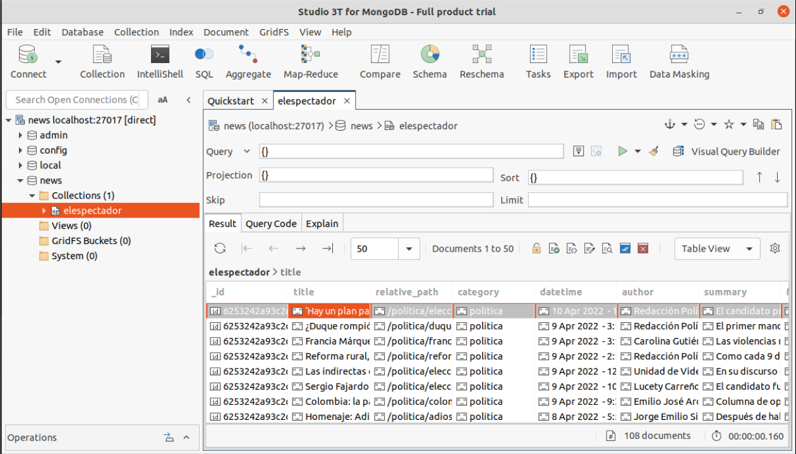

# web-scraping-tutorial
Code to build a web scraper to perform extraction of articles of five categories of news of the web page "El Espectador", transforming the data to a schema to allow persist the articles in a collection of MongoDB for implement an frequency analysys to dataset and show the result in a wordcloud.

## Table of Contents
 - [Requirements](#requirements).
 - [Evidence MongoDB](#evidence-mongodb).
 - [Usage](#usage).
 - [References](#references).
 - [Author](#author).
 

## Requirements
 - Ubuntu - version 20.04.
 - Python - version 2.7.18.
 - MongoDB - version v3.6.8.
 - Jupyter Lab - version 3.3.3.
 

## Evidence MongoDB
 - Evidence screenshot of data insertion in MongoDB.
 
 
	
	
## Usage
 - The video evidence of the correct functioning of each of the requested requirements can be found in the following [link](https://youtu.be/ay33pjBcgY8).
	
	
## References
 - Script was based on the [repository](https://github.com/bigdata-unbosque/web-scraping-tutorial) that was seen in class.

## Author
 - Jorge Octavio Florez Caro.
